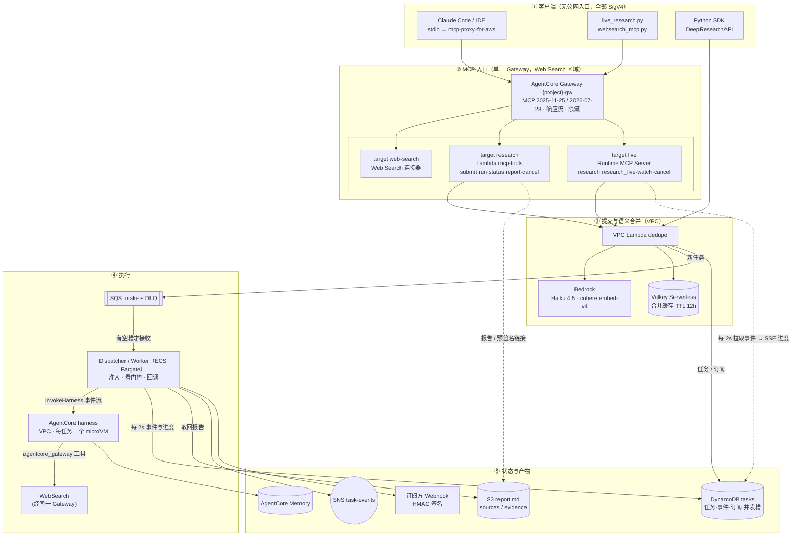
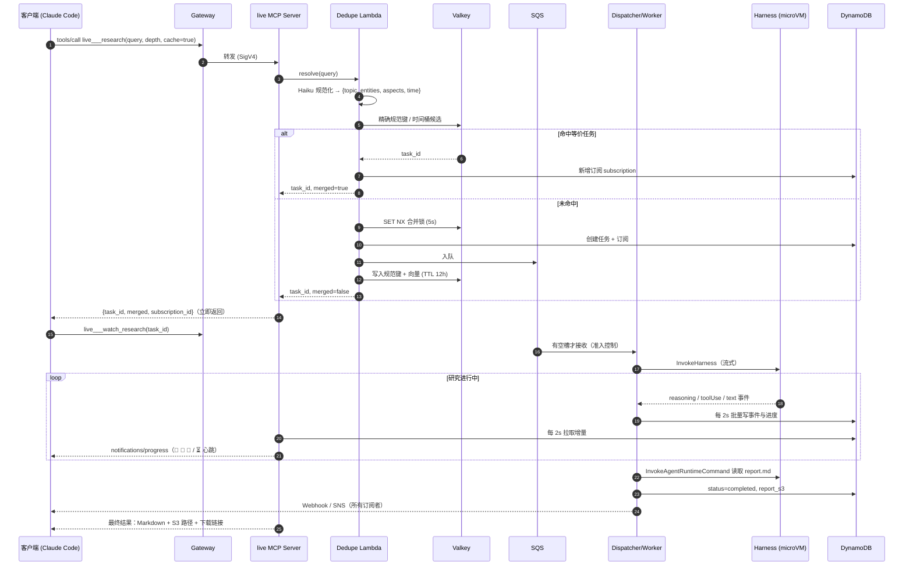
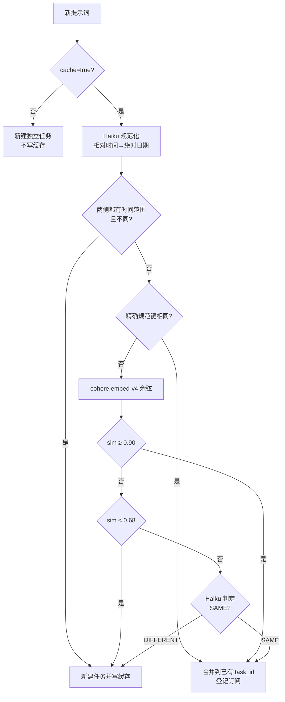
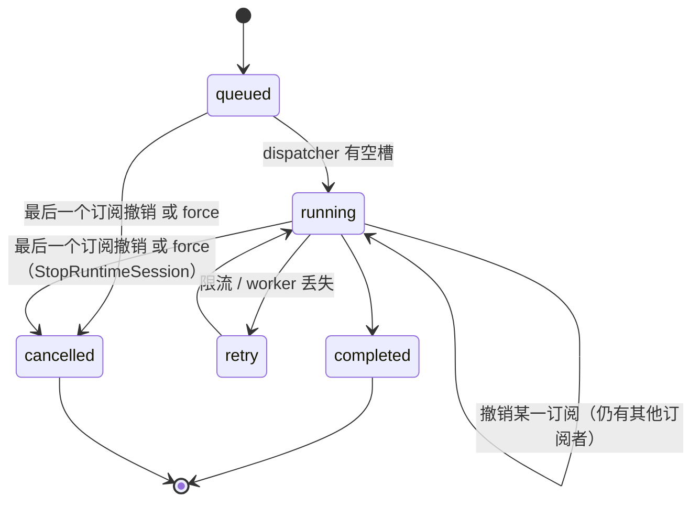

# Deep Research on Amazon Bedrock AgentCore

面向 1 → 10000 并发的 Deep Research Agent 服务。采用**纯 AgentCore harness 方案**，没有公网入口，代码不绑定区域和账号。支持两种部署方式：

| 方式 | 适用 | 入口 |
|---|---|---|
| **CloudFormation 一键部署**（推荐） | 任意账号，us-east-1 / eu-west-1 / ap-northeast-1（Web Search 连接器所在区域）；新建 VPC 或复用已有 VPC | [`deploy/cloudformation/deepresearch.yaml`](deploy/cloudformation/deepresearch.yaml)，见 [docs/CLOUDFORMATION.md](docs/CLOUDFORMATION.md) |
| boto3 脚本（开发） | 复用已有栈的资源；Gateway 与 harness 可以放在不同区域 | `scripts/deploy.py` + `config/local.yaml`（例如现有的 nxdev 部署：us-west-2 复用 `nx` 栈，Gateway 在 us-east-1） |

```bash
aws cloudformation deploy --region us-east-1 --stack-name deepresearch-prod \
  --template-file deploy/cloudformation/deepresearch.yaml --s3-bucket <同区域的任意桶> \
  --capabilities CAPABILITY_NAMED_IAM CAPABILITY_AUTO_EXPAND --parameter-overrides EnvironmentId=prod
python scripts/use_stack.py deepresearch-prod --region us-east-1 && source config/stacks/deepresearch-prod.env
```

| 能力 | 实现 |
|---|---|
| 研究循环 | AgentCore harness（Strands 驱动，Claude Sonnet 4.6 + extended thinking），技能包 `skills/deep-research-harness`（8 阶段：SCOPE→PLAN→RETRIEVE→TRIANGULATE→…→VALIDATE） |
| 搜索 | AgentCore Gateway 内置 **Web Search 连接器**（us-east-1 / eu-west-1 / ap-northeast-1，支持域名/日期过滤），同一轮多查询并行 |
| 协议 | 单一 MCP Gateway，**MCP 2025-11-25 + 2026-07-28（无状态）**，SigV4 鉴权 |
| 调用模式 | **异步（默认）**、同步、实时流式、完成回调（Webhook + SNS） |
| 语义合并 | 同义提示词 12 h 内共享同一 `task_id`（Haiku 规范化 + `cohere.embed-v4` + Valkey），`cache` 参数可关闭 |
| 取消 | 订阅模型：撤销自己的订阅不影响共享任务；`force` 才停止后端 |
| 弹性 | SQS + DynamoDB 令牌桶准入（并发槽 / 会话创建速率 / 搜索预算 / 限流退避），每任务一个 microVM |
| 独立搜索 | `scripts/websearch_mcp.py`：不依赖研究流水线的 stdio MCP / CLI |

---

## 1. 架构

### 1.1 组件总览



### 1.2 一个研究任务的生命周期（异步 + 缓存 + 流式）



### 1.3 语义合并判定



| 示例 | 结果 | 原因 |
|---|---|---|
| "调研最近1天的科技新闻" / "给出昨天的科技新闻" / "Summarize yesterday's tech news" | 同一 task_id | 规范键完全相同（time=昨日） |
| "调研最近1天的科技新闻" / "调研最近1天的体育新闻" | 不同 | 相似度 0.63 < 0.68 |
| "调研最近1天的科技新闻" / "调研最近一个月的科技新闻" | 不同 | 时间硬门 |

### 1.4 取消语义（订阅模型）



---

## 2. API 一览

所有工具都通过同一个 MCP endpoint 暴露，即栈输出 `GatewayUrl`，形如 `https://<project>-<env>-gw-<id>.gateway.bedrock-agentcore.<region>.amazonaws.com/mcp`。现有 nxdev 部署的地址是：

```
https://nxdev-deepresearch-gw-ff2tunugib.gateway.bedrock-agentcore.us-east-1.amazonaws.com/mcp
```

| 工具（Claude Code 内前缀 `mcp__nx-deep-research__`） | 模式 | 主要参数 | 返回 |
|---|---|---|---|
| `live___research` | **异步（默认）** | `query`, `depth`=quick\|standard\|deep, `callback_url`, `cache`=true | `task_id`, `merged`, `subscription_id`, `canonical` |
| `live___research_live` | **同步（单次阻塞）** + 实时流 | `query`, `depth`, `cache`；请求 `_meta` 需带 `progressToken` | 流式进度与 20 s 心跳，最终 Markdown + `report_s3` + `download_url` |
| `live___watch_research` | 流式观看 | `task_id`, `cancel_on_disconnect` | 同上；单窗口约 13.5 分钟，未完成返回 `still running` 可再次调用 |
| `live___research_status` | 查询 | `task_id` | 状态、进度、结果 |
| `live___cancel_research` | 取消 | `task_id`, `subscription_id`, `force` | 撤销订阅或停止后端 |
| `research___submit_research` | 异步 | `query`, `depth`, `callback_url`, `cache` | 同 `live___research` |
| `research___run_research` | 限时同步 | `query`, `depth`, `wait_seconds`≤300, `cache` | 300 s 内完成则返回 Markdown，否则返回 `status=running` + `task_id`（用 `watch_research` 接续） |
| `research___get_research_status` | 查询 | `task_id` | 状态、进度计数、最近推理/工具步骤 |
| `research___get_research_report` | 取报告 | `task_id`, `mode`=content\|url | Markdown 正文或 1 小时预签名链接 |
| `research___cancel_research` | 取消 | `task_id`, `subscription_id`, `force` | 同上 |
| `web-search___WebSearch` | 同步 | `query`, `maxResults`, `filters.domainFilter` / `publishedDateFilter` | 标题、URL、摘要、发布日期 |

深度档位：

| depth | 搜索次数目标 | 报告规模 | 实测耗时 |
|---|---|---|---|
| quick | 6–10 | 3 节，800–1500 词 | 5–8 分钟（实测 319–466 s） |
| standard | 15–25 | 4–6 节，2000–4000 词 | 8–11 分钟（实测 502–656 s） |
| deep | 30–45 | 6–8 节，4000–8000 词 | 8–11 分钟（实测 484–659 s，同一轮内多查询并行） |

报告统一写入 `s3://<bucket>/reports/YYYY/MM/DD/<task_id>/report.md`，同目录含 `sources.jsonl`、`evidence.jsonl`。桶名：CFN 部署为 `<project>-<env>-<account>-<region>`，nxdev 部署为 `nxdev-deepresearch-131166810173-us-west-2`。

---

## 3. 快速开始

```bash
cd /home/core/Workspace/projects/deepresearch
python3 -m venv .venv && source .venv/bin/activate && pip install -r requirements.txt   # 之后每个新终端先 source .venv/bin/activate

python scripts/deploy.py                      # 幂等部署全部组件（可 --only gateway|skills|queues|dedupe|mcp-tools|live|harness）
python scripts/run_dispatcher.py --log-file logs/dispatcher.log    # 常驻调度器（生产部署到 EKS：deploy/k8s/dispatcher.yaml）
bash scripts/setup_claude_mcp.sh              # Claude Code 接入（user 作用域，最小权限 IAM 密钥 + SigV4 代理）
```

常用命令：

```bash
# 终端实时看推理过程（Ctrl+C 撤销订阅；超过单个流窗口会自动重挂）
python scripts/live_research.py "研究问题" --depth deep --cache false --save ./reports/x.md

# SDK / CLI
python scripts/submit.py "研究问题" --depth quick --follow --print-report

# 独立搜索（不依赖研究流水线）
python scripts/websearch_mcp.py --search "关键词" --max 5 --include aws.amazon.com
claude mcp add -s user -e AWS_PROFILE=<mcp-profile> -e NX_GATEWAY_URL=<GatewayUrl> websearch -- $(pwd)/.venv/bin/python $(pwd)/scripts/websearch_mcp.py

# 语义合并运维
python scripts/validate_embed.py                               # 14 条正负例回归
python scripts/validate_embed.py --pair "问题A" "问题B"         # 两条提示词是否合并及原因
python scripts/dedupe_cache.py stats | lookup "问题" | clear

# 调试与配额
python scripts/debug_task.py --list 10 ; python scripts/debug_task.py <task_id> --logs
python scripts/request_quotas.py --target 10000 [--apply]
```

Claude Code 提示词示例：

```
用 nx-deep-research 的 research 工具（异步）提交"2026 年主流开源向量数据库对比"（depth=standard），
告诉我 task_id 和是否 merged，然后用 watch_research 观看直到完成，把 Markdown 保存到 ./reports/vdb.md。
```

---

## 4. 测试

| 层级 | 命令 | 覆盖 |
|---|---|---|
| 单元 | `python -m pytest tests/unit -q` | 容量公式、事件流解析、任务存储/准入、合并判定规则、准入不消耗 SQS 接收次数、判定器输入（19 条） |
| pytest e2e | `DR_E2E=1 python -m pytest tests/e2e -m e2e -v --timeout=2400` | Gateway、harness、流水线、MCP 2026-07-28、回调、流式、取消、语义合并、cache=false、WebSearch MCP（22 条） |
| **全 API 矩阵** | `python scripts/e2e_matrix.py [--only C3,C5] [--skip-deep] [--keep]` | 12 个场景 × quick/standard/deep × 异步/缓存/同步/流式/回调/取消，逐份报告结构校验，结果写 `e2e_out/matrix/SUMMARY.md` |
| Claude Code 打印模式 | `bash scripts/e2e_claude_print.sh live -q "问题" -d quick -o ./reports/x.md` | 以真实 Claude Code 调用 MCP，核验本地 .md 与 S3 副本 |
| 合并策略 | `python scripts/validate_embed.py` | 规范化 + 向量 + 判定器的正负例 |

### 4.1 全 API 矩阵最近一次结果

2026-09-28，在全部修复后的代码上一次性并行运行（`python scripts/e2e_matrix.py`），**12/12 通过**；同时并行运行的 pytest e2e 套件 **22/22 通过**（18 分 34 秒），单元测试 19/19 通过。每份报告均通过 `validate_report.py` 结构校验并保存在 `e2e_out/matrix/<用例>.md`。

| 用例 | 场景 | 深度 | 模式 | 结果 | 耗时(s) | 关键数据 |
|---|---|---|---|---|---|---|
| C1 | Gateway 直连：discover + tools/list + WebSearch(域名过滤) | — | sync | ✅ | 1 | tools=12, results=3 |
| C2 | 独立 WebSearch MCP 脚本 (CLI) | — | sync | ✅ | 1 | count=3 |
| C3 | research___submit_research 异步 + 缓存合并 + 完成后命中 | quick | async+cache | ✅ | 37 | task_id=t1790574699-7fc3d49ea0, chars=10413, validator_passed=True, subscribers=12, cache_hit_after_completion_s=10.8, searches=10 |
| C4 | live___research 异步(默认) + watch_research 流式 | standard | async+stream, cache=false | ✅ | 656 | task_id=t1790581377-19e755d375, chars=16314, validator_passed=True, events=60, windows=1, reasoning=2, narration=21 |
| C5 | live___research_live 同步单次阻塞调用（单窗口内完成） | quick | sync, cache=false | ✅ | 466 | task_id=t1790581377-7da06312c6, chars=8535, validator_passed=True, wall_s=466, keepalive_notifications=60 |
| C5b | research___run_research 限时同步(≤300s)+watch 接续 | quick | sync-bounded, cache=false | ✅ | 325 | task_id=t1790581375-4c951aaca3, chars=11874, validator_passed=True, sync_call_s=306, total_s=325 |
| C6 | live___research_live 提交+流式(多窗口重挂) | deep | stream, cache=false | ✅ | 484 | task_id=t1790581377-f60da69476, chars=19711, validator_passed=True, events=57, windows=1, reasoning=2, narration=17 |
| C7 | Python SDK submit + 签名 webhook 回调 | quick | async+callback, cache=false | ✅ | 370 | task_id=t1790581375-a948ed0695, chars=11792, validator_passed=True |
| C8 | 强制取消运行中的 deep 任务 | deep | cancel force | ✅ | 50 | task_id=t1790581376-f4dd62ce80, session_stopped=True |
| C9 | 合并任务：撤销单个订阅不停后端 | quick | cache merge + detach | ✅ | 26 | task_id=t1790581388-daf17f9c3b |
| C10 | cache=false 不写缓存，后续缓存请求不合并到它 | quick | cache on/off | ✅ | 26 |  |
| C11 | 缓存命中已完成的 standard 任务，立即返回报告 | standard | async+cache hit | ✅ | 16 | task_id=t1790574702-94cc3d910a, chars=12575, validator_passed=True, cache_hit_s=8.3 |

说明：C3 这次首个提交就命中了上一轮已完成的同义任务（12 个订阅来自多轮测试），完成后再次提交 10.8 秒拿到结果；C11 对已完成的 standard 任务 8.3 秒命中。C5 的 60 条保活通知是每 20 秒一次的 `⏳` 心跳加研究步骤。

### 4.3 CloudFormation 部署上的全 API 矩阵（2026-09-28，us-east-1，新建 VPC，Fargate 调度器）

在由 `deploy/cloudformation/deepresearch.yaml` 创建的栈 `deepresearch-e2e2` 上运行（`use_stack.py` + `DR_E2E_OUT=e2e_out/matrix-deepresearch-e2e2`）：**12 通过、0 失败、1 跳过**。C7 使用本机 `127.0.0.1` 接收 webhook，运行在 Fargate 私有子网里的调度器访问不到，所以跳过；完成通知改由 C7b 通过 SNS → 临时 SQS 端到端验证。

| 用例 | 深度 | 模式 | 结果 | 耗时(s) | 关键数据 |
|---|---|---|---|---|---|
| C1 Gateway 直连 + WebSearch | — | sync | ✅ | 1 | tools=12 |
| C2 独立 WebSearch MCP | — | sync | ✅ | 1 | count=3 |
| C3 异步 + 缓存合并 + 完成后命中 | quick | async+cache | ✅ | 10 | 完成后命中 1.5 s |
| C4 `live___research` 异步 + `watch_research` | standard | async+stream | ✅ | 540 | 34 KB 报告，57 条流事件 |
| C5 `research_live` 单次阻塞 | quick | sync | ✅ | 323 | 49 条保活通知 |
| C5b `run_research` 限时同步 + 接续 | quick | sync-bounded | ✅ | 368 | 同步调用 302 s |
| C6 `research_live` 流式 | deep | stream | ✅ | 615 | 26 KB 报告 |
| C7 本机 webhook | quick | callback | ⏭️ | — | 远端调度器不适用 |
| C7b SNS 完成通知 | quick | async+SNS | ✅ | 349 | SNS → SQS 送达后下载报告 |
| C8 强制取消 | deep | cancel | ✅ | 56 | session_stopped=True |
| C9 合并任务撤销订阅 | quick | merge+detach | ✅ | 18 | |
| C10 cache=false 不入缓存 | quick | cache on/off | ✅ | 37 | |
| C11 命中已完成的 standard 任务 | standard | cache hit | ✅ | 23 | 12.2 s 返回报告 |

另外一个栈 `deepresearch-e2e3` 测试了复用已有 VPC、关闭语义缓存、harness 使用 VPC 模式、不创建客户端用户这组参数，过程中发现并修复了 harness 执行角色缺少 ECR 拉取权限的问题（见 [docs/CLOUDFORMATION.md](docs/CLOUDFORMATION.md) 第 6 节）。

### 4.2 本轮端到端测试发现并修复的问题

| 问题 | 影响 | 修复 |
|---|---|---|
| 并发槽满时 dispatcher 把消息退回队列，累加 SQS 接收次数，3 次后进入 DLQ | 突发流量下任务永久停在 `queued` | 只在有空槽时收消息；`max_receive_count=50`；启动时回捞 DLQ 中未完成任务 |
| 无字节传输的长响应约 350 秒被网络路径断开（326 s 成功、≥356 s 全部丢失） | 同步调用客户端卡死，尽管 Lambda 已返回 | `run_research` 限时 300 s 并优雅返回 `running`；`research_live` 每 20 s 心跳；客户端收到结果即停止读取 |
| 不带 progressToken 时 Gateway 不建立 SSE 流，整个响应被缓冲 | 纯 JSON 客户端拿不到心跳 | 同步模式要求携带 progressToken（标准 MCP 客户端默认携带）；否则用 `run_research` + `watch_research` |
| 技能脚本预装用 curl 经 NAT 拉 S3，偶发挂起且无超时 | 任务在首个事件前卡 8–16 分钟 | 改为 base64 内联写入（无网络依赖），命令墙钟超时 120 s，失败换新 microVM 重试；另加看门狗：`running` 8 分钟无进度自动重排 |
| 多线程并发创建 boto3 客户端不安全，命令 API 共用 3700 s 读超时 | 可能放大上一个问题 | 客户端加锁单例；命令 API 180 s 读超时 |
| 语义合并判定器收到的是规范化 JSON 而非原始提示词 | 灰区同义请求偶发不合并 | 判定器改用原始提示词，新增单测 |


---

## 5. 配置要点

配置按以下顺序合并，后者覆盖前者：`config/settings.yaml`（通用默认值，不含账号、区域和环境名）< `config/local.yaml` 或 `DR_LOCAL_FILE` 指定的覆盖文件 < 环境变量 `DR_<SECTION>_<KEY>` / `DR_PROJECT` / `DR_REGION`。运行时状态（各资源的 ARN、URL）先读 `DR_STATE_<KEY>`，再读 `config/deploy_state.json` 或 `DR_DEPLOY_STATE` 指定的文件。区域为空时依次取 `DR_REGION` / `AWS_REGION` / boto3 默认值；名称中的 `{project}` / `{region}` / `{account_id}` 会被替换，账号 ID 通过 STS 获取。

| 键 | 默认 | 说明 |
|---|---|---|
| `harness.model_id` | `global.anthropic.claude-sonnet-4-6` | 研究模型 |
| `harness.thinking_budget_tokens` | 3000 | extended thinking（流中 💭 推理可见），0 关闭 |
| `dispatcher.max_inflight` | 100 | 执行中任务上限 C（按 docs/QUOTAS.md 随配额放大） |
| `dispatcher.session_create_per_sec` | 20 | 新会话令牌桶 |
| `queue.max_receive_count` | 50 | SQS 进入 DLQ 前的接收次数；启动时自动回捞 DLQ 中未完成任务 |
| `DR_WATCHDOG_STALE_SECONDS` | 480 | `running` 且无进度超过该秒数的任务自动 retry 并重排 |
| `DR_SYNC_WAIT_CAP` | 300 | `run_research` 最长阻塞秒数（须低于约 350 s 的空闲断开） |
| `dedupe.enabled` / `ttl_seconds` / `window_seconds` | true / 43200 / 5 | 语义合并开关、缓存 TTL、合并窗口 |
| `dedupe.similarity_high` / `similarity_low` | 0.90 / 0.68 | 向量直接合并 / 直接分开阈值，中间交判定器 |
| `dedupe.embed_model` | `global.cohere.embed-v4:0` | 全局推理配置，三个 Web Search 区域均可用（nxdev 覆盖为 `us.`） |

---

## 6. 文档

| 文档 | 内容 |
|---|---|
| [docs/ARCHITECTURE.md](docs/ARCHITECTURE.md) | 复用的 nx 栈资源、任务生命周期、语义合并层 |
| [docs/CLOUDFORMATION.md](docs/CLOUDFORMATION.md) | CloudFormation 一键部署：参数、资源、升级回滚、实测记录 |
| [docs/CHINA_DEPLOYMENT.md](docs/CHINA_DEPLOYMENT.md) | 中国区（北京 / 宁夏）方案：中国区 AgentCore（Runtime / Gateway / Identity / Code Interpreter / Browser）+ 美国 Web Search + LiteLLM、跨境与合规 |
| [docs/DEPLOYMENT.md](docs/DEPLOYMENT.md) | 安装、boto3 脚本部署、Claude Code 接入、各模式说明、生产部署要点、清理 |
| [docs/QUOTAS.md](docs/QUOTAS.md) | 10000 并发的配额清单、Quota Code、一键申请、实测校准 |
| [docs/DEBUGGING.md](docs/DEBUGGING.md) | 日志位置、`debug_task.py`、症状 → 处理对照表 |
| [docs/TODO.md](docs/TODO.md) | 待办与已完成事项 |

目录结构：

```
src/deepresearch/      config · aws_clients · infra/ · harness_client · task_store · queue · dispatcher · worker · api
                       cancel · dedupe_core · dedupe · dedupe_lambda · mcp_tools_lambda · live_mcp_server · mcp_client · capacity
skills/deep-research-harness/   SKILL.md + scripts（citation_manager / evidence_store / validate_report）
                       cfn_custom（CloudFormation 自定义资源）
scripts/               deploy · teardown · use_stack · run_dispatcher · live_research · submit · e2e_matrix · e2e_claude_print.sh
                       setup_claude_mcp.sh · websearch_mcp · validate_embed · dedupe_cache · debug_task · request_quotas
deploy/                cloudformation/deepresearch.yaml · build_artifacts.py · artifacts.Dockerfile · runtime/live_main.py · k8s/
tests/unit, tests/e2e  config/settings.yaml（通用）· config/local.yaml（nxdev 覆盖）· config/stacks/（use_stack.py 生成）
```

## 7. 已知限制

- 单次流式调用受 Gateway 15 分钟上限约束，超过后需 `watch_research` 重挂（`live_research.py` 与矩阵脚本已自动处理，dispatcher 重启恢复场景下已实测多窗口重挂成功）。
- 非流式长响应约 350 s 会被网络路径断开：同步请用带 progressToken 的 `research_live`，或 `run_research`（≤300 s）+ `watch_research`。
- harness 内部 MCP 客户端最高协商 2025-11-25，因此 Gateway 必须保留该版本。
- Valkey Serverless 8.1 无向量索引，合并在时间桶内做应用层余弦（上限 `max_candidates=200`）。
- nxdev 部署的 dispatcher 仍是单机进程（`setsid nohup` 常驻）；CloudFormation 部署使用 ECS Fargate 服务（`DispatcherDesiredCount` 可扩展到多个任务）。
- Web Search 连接器仅 us-east-1 / eu-west-1 / ap-northeast-1；中文检索质量未系统评估。
