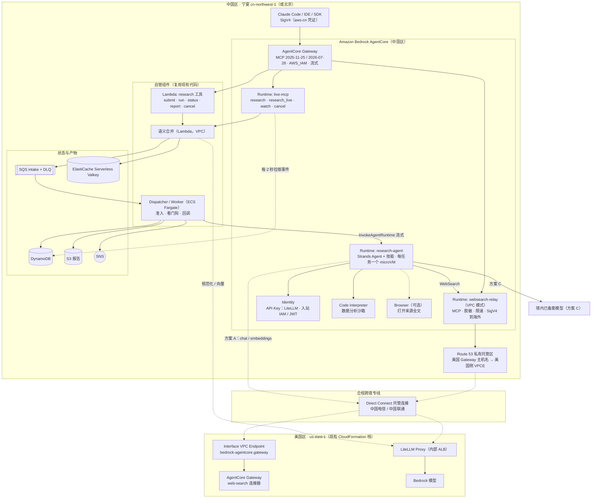
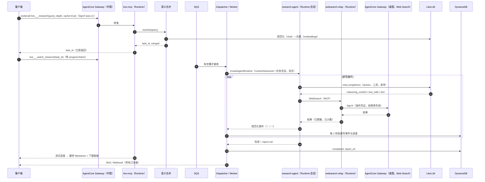
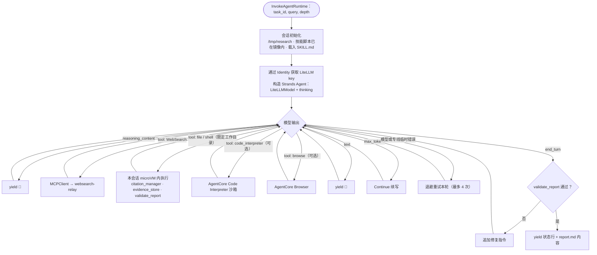
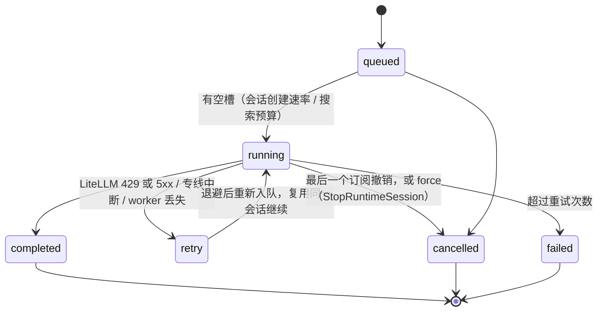
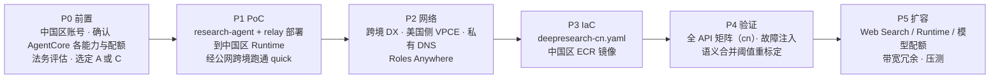

# 中国区（北京 / 宁夏）部署方案：中国区 AgentCore + 美国区 Web Search Gateway + LiteLLM

> 更新：2026-09-28。前提（以中国区官方文档 https://docs.amazonaws.cn/en_us/bedrock-agentcore/?region=cn-north-1 为准）：**Amazon Bedrock AgentCore 在中国区提供 Runtime、Gateway、Identity、Browser、Code Interpreter**；**不提供 Bedrock 基础模型 API，也不提供 AgentCore harness**。Memory、Observability、Policy、Evaluations、Gateway 的 Web Search 连接器不在上述确认范围内，本方案**不依赖**它们，标为“待验证”。

## 0. 结论速览

| 问题 | 结论 |
|---|---|
| 能否在中国区做出与美国区类似的效果？ | **能，而且大部分平台能力仍由 AgentCore 托管。** 每会话一个 microVM（Runtime）、单一 MCP 入口加 IAM 鉴权和流式（Gateway）、凭证托管（Identity）、沙箱代码执行（Code Interpreter）、网页浏览（Browser）都在中国区；只有**研究循环**（原来的 harness）、**模型**和 **Web Search** 需要另外解决 |
| harness 的替代 | 研究 agent 由自己编写，用开源的 **Strands Agents**（Apache-2.0，与 harness 同源；可以从美国区 harness 导出 Strands 代码作为起点），加上 **LiteLLM 模型提供方**，以容器或代码包形式部署到**中国区 AgentCore Runtime**。每个任务一个 Runtime 会话，隔离级别与 harness 相同 |
| 模型 | **LiteLLM**（OpenAI 兼容）端点：方案 A 使用美国区端点（后接 Bedrock Claude 等）；方案 C 路由到境内已备案模型。LiteLLM 的 key 由 **AgentCore Identity 的 API Key 凭证提供方**托管 |
| Web Search | **沿用美国区 AgentCore Gateway 的 Web Search 连接器。** 中国区部署一个 **websearch-relay**（Runtime 上的 MCP Server，VPC 模式），通过合规跨境专线、用海外 IAM 凭证做 SigV4 签名来调用美国 Gateway；中国区 Gateway 再把它作为 MCP Server target 暴露出去 |
| 队列 / 状态 | **不需要替代 SQS。** SQS、SNS、DynamoDB、ElastiCache Serverless Valkey、Lambda、ECS/Fargate 在中国区都可用，现有调度器和准入控制原样复用 |
| 推荐 | **生产用方案 C**（只有 Web Search 跨境，1 万并发约 50 Mbps）；**PoC 或内部研发用方案 A**（模型也在美国，1 万并发约 1–2 Gbps 跨境）。两者代码相同，只有 LiteLLM 路由配置不同 |
| 相对美国区的改造量 | 新写一个研究 agent（约 1 周），调整 worker 的调用接口，再写中国区模板；其余代码复用（见第 8 节） |

---

## 1. 能力对照

### 1.1 中国区 AgentCore 与周边服务

| 能力 | 美国区（现状） | 中国区 | 本方案用法 |
|---|---|---|---|
| AgentCore **harness** | ✓（研究循环） | ✗ | 用自研 Strands agent + Runtime 替代 |
| **Bedrock 模型 API** | ✓ | ✗ | 改用 LiteLLM（美国或境内模型） |
| AgentCore **Runtime** | ✓ | ✓ | ① research-agent（研究循环，每任务一个会话）；② live-mcp（流式 MCP Server，复用现有代码）；③ websearch-relay（跨境搜索中继） |
| AgentCore **Gateway** | ✓（含 Web Search 连接器） | ✓（Web Search 连接器**待验证，按不可用设计**） | 中国区单一 MCP 入口：Lambda target（research 工具）、MCP Server target（live-mcp、websearch-relay） |
| AgentCore **Identity** | ✓ | ✓ | 入站：Runtime 和 Gateway 用 IAM（aws-cn）或 JWT；出站：API Key 凭证提供方保存 LiteLLM key，OAuth 提供方可以对接海外 IdP |
| AgentCore **Code Interpreter** | ✓ | ✓ | 模型生成的数据分析代码在沙箱中执行（图表、统计）；技能自带的可信脚本直接在 research-agent 会话里运行 |
| AgentCore **Browser** | ✓ | ✓ | 可选：打开搜索结果全文核验。受境内网络环境影响，境外站点可能无法访问，只作为增强能力 |
| AgentCore Memory / Observability / Policy / Evaluations | ✓ | 待验证 | 不依赖：会话上下文存在 Runtime 会话和 S3，追踪用 CloudWatch 和 ADOT |
| SQS / SNS / DynamoDB / Lambda / ECS Fargate（Graviton） / ElastiCache Serverless Valkey / Secrets Manager | ✓ | ✓（中国区服务表、定价页） | 原样复用 |
| 跨境专线 | — | Direct Connect 跨境托管连接（中国电信 / 中国联通 ChinaDX，AWS Marketplace，10–500 Mbps，1–12 个月，约一周开通） | 承载 Web Search 与（方案 A 的）模型流量 |

### 1.2 组件映射

| 美国区组件 | 中国区组件 | 说明 |
|---|---|---|
| `AWS::BedrockAgentCore::Harness` + `Custom::HarnessThinking` | `AWS::BedrockAgentCore::Runtime`（research-agent） | agent 代码：Strands `Agent`、`LiteLLMModel`、技能提示词和工具；思考参数由代码直接设置，不再需要自定义资源 |
| Gateway Target `web-search`（连接器） | Gateway Target `web-search`（MCP Server → websearch-relay Runtime） | relay 对外暴露同名工具 `WebSearch`，参数兼容（`query` / `maxResults` / `filters`），客户端无需修改 |
| Gateway Target `research`（Lambda） | 同左 | 复用 `mcp_tools_lambda` |
| Gateway Target `live`（Runtime MCP） | 同左 | 复用 `live_mcp_server` |
| worker 调用 `InvokeHarness` | worker 调用 `InvokeAgentRuntime`（research-agent，流式） | agent 输出与现在相同的规范化事件，`worker.py` 只需要换客户端 |
| `InvokeAgentRuntimeCommand` 预装技能脚本 | 技能脚本直接打进 agent 镜像 / 代码包 | 不需要 base64 内联 |
| `StopRuntimeSession`（取消） | 同左 | 不变 |
| Bedrock（语义合并：Haiku 规范化 + cohere 向量） | LiteLLM `/v1/chat/completions` + `/v1/embeddings` | 换向量模型后，需要用 `validate_embed.py` 重新标定阈值 |
| Docker Hub → S3 制品 | 中国区 ECR（`*.dkr.ecr.cn-northwest-1.amazonaws.com.cn`）或 S3 代码包 | Runtime 容器地址要求是 ECR；中国区 Runtime 是否支持代码包直接部署**待验证** |

---

## 2. 总体架构



说明：
- **单一 MCP 入口仍然是 AgentCore Gateway**，这次是中国区的 Gateway。工具名与美国区保持一致（`web-search___WebSearch`、`research___*`、`live___*`），Claude Code 的提示词和脚本不用改，只需把端点和签名区域换成中国区。
- **websearch-relay 是唯一的跨境搜索出口**，脱敏、限速（令牌桶，与美国 Web Search TPS 配额对齐）、审计日志都集中在这里。research-agent 调用它，外部客户端也能通过中国区 Gateway 调用它。
- **模型出口**：方案 A 走专线到美国 LiteLLM；方案 C 由 LiteLLM 路由到境内模型。LiteLLM 可以部署在中国区（Fargate），统一作为 agent 的模型端点，由它决定哪些模型走境内、哪些走海外。

---

## 3. 流程

### 3.1 研究任务生命周期（异步 + 缓存 + 实时流）



### 3.2 research-agent 内部（替代 harness）



### 3.3 任务状态



---

## 4. 跨境方案对比（按美国区实测 token 量计算）

实测数据（美国区，2026-09-28），按每个任务统计：

| 深度 | 输入 token | 输出 token | Web Search 次数 | 耗时 |
|---|---|---|---|---|
| quick | 0.55–1.0 M | 1.2–1.5 万 | 9–10 | 5–6.5 分钟 |
| standard | 1.71 M | 1.9 万 | 17 | 约 9 分钟 |
| deep | 1.94 M | 2.7 万 | 20 | 约 10 分钟 |

每一轮都会重发完整上下文，按每 token 约 4 字节估算，模型上行约 2–8 MB/任务，平均约 **0.1 Mbps/任务**。每次 Web Search 按 10–30 KB 估算，约 **0.005 Mbps/任务**。

| 方案 | 美国区提供 | 中国区提供 | 跨境带宽（1 万并发，平均，峰值留 2 倍） | 适用 |
|---|---|---|---|---|
| **A**（题目要求） | Web Search Gateway + LiteLLM（Bedrock Claude 等） | AgentCore Runtime / Gateway / Identity / Code Interpreter / Browser + 队列与状态 | **约 1 Gbps**，建议 2 Gbps；单条托管连接 ≤ 500 Mbps，需要多条或专用端口 | PoC、内部研发、必须使用海外模型的场景 |
| **B** | 整套现有栈（harness 在美国） | 只有入口 | < 10 Mbps | 改造量最小，但研究执行和数据处理都在境外 |
| **C（推荐生产）** | 只有 Web Search Gateway | 同 A；LiteLLM 路由到**境内已备案模型** | **约 50 Mbps** | 面向公众、对数据出境敏感的场景 |

---

## 5. 网络与鉴权

### 5.1 跨境链路

1. 在 AWS Marketplace 订阅中国电信或中国联通的跨境托管连接（宁夏 ↔ 弗吉尼亚北部），建立私有 VIF 和 Direct Connect 网关；两边 VPC 的 CIDR 不能重叠。
2. 美国区 VPC：创建 `com.amazonaws.us-east-1.bedrock-agentcore.gateway` 接口端点；LiteLLM 放在内部 ALB 后面。
3. 中国区 VPC：用 Route 53 私有托管区把 `<gw-id>.gateway.bedrock-agentcore.us-east-1.amazonaws.com` 解析到美国侧 VPCE 的 IP（主机名不变，TLS 校验照常通过）。websearch-relay 和 research-agent 的 Runtime 用 **VPC 模式**部署在这些子网里。
   - 我们在美国区实测过：VPC 模式的 Runtime 需要执行角色有 ECR 拉取权限（`ecr:GetAuthorizationToken` / `BatchGetImage` / `GetDownloadUrlForLayer`），另外删除栈时 AgentCore 托管的网卡回收较慢。见 [CLOUDFORMATION.md](CLOUDFORMATION.md)。
4. PoC 可以先用公网 NAT 直连美国 Gateway 的公网端点，**但不能用于生产**。

### 5.2 凭证

| 调用 | 凭证 | 托管方式 |
|---|---|---|
| 客户端 → 中国区 Gateway | aws-cn 分区的 IAM 身份，只允许 `bedrock-agentcore:InvokeGateway`（现有模板里的 `McpClientPolicy` 可以直接沿用） | 客户端 profile；或者 Gateway 改用 JWT 入站，对接企业 IdP |
| Gateway → live-mcp / websearch-relay Runtime | `GATEWAY_IAM_ROLE`（`bedrock-agentcore` 服务签名，中国区） | 模板自动创建 |
| research-agent → LiteLLM | LiteLLM 虚拟 key | **Identity API Key 凭证提供方**（agent 通过 workload identity 取用） |
| websearch-relay → 美国 Gateway | 海外账号中只允许 `InvokeGateway` 的身份：推荐 **IAM Roles Anywhere** 临时凭证，也可以用现有栈的 `McpClientSecret` 静态密钥 | 中国区 Secrets Manager（静态密钥定期轮换） |
| worker → research-agent | ECS 任务角色：`InvokeAgentRuntime` / `StopRuntimeSession` | 模板自动创建 |

### 5.3 客户端接入

- 端点：`https://<gw-id>.gateway.bedrock-agentcore.cn-northwest-1.amazonaws.com.cn/mcp`（域名格式**待验证**，以 CloudFormation 输出 `GatewayUrl` 为准）。
- `mcp-proxy-for-aws`：`--service bedrock-agentcore --region cn-northwest-1`，并使用 aws-cn 分区凭证。它是否能处理 `amazonaws.com.cn` 域名**待验证**；如果不行，就用本仓库的 stdio 代理（`mcp_client.py`）。
- 协议版本保持 2025-11-25 和 2026-07-28；长调用要带 `progressToken`，20 秒心跳保持不变。

---

## 6. 1 万并发的容量与配额

| 维度 | 需求（约 10 分钟/任务） | 处理 |
|---|---|---|
| **美国 Web Search TPS** | 约 20 次/任务 → **约 333 TPS**（默认 10 TPS） | 提配额；在 websearch-relay 和调度器两层都设置令牌桶 |
| 中国区 Runtime 并发会话 / 会话创建速率 | 1 万个 research-agent 会话 | 按 [QUOTAS.md](QUOTAS.md) 的同名配额，向中国区申请提升 |
| 中国区 Gateway 调用速率 | 客户端调用 + agent 的搜索调用（agent 直连 relay，不经 Gateway） | Gateway 限流按主体计数 |
| LiteLLM 后端 | 3–4 万 RPM；输入约 1.5–2 亿 TPM | 多部署负载均衡 + 回退；前缀缓存 |
| 跨境带宽 | A：1–2 Gbps；C：50–100 Mbps | 双运营商、双链路冗余 |
| SQS / DynamoDB / SNS / Valkey | 小 | 按需模式 |

---

## 7. 合规要点（需法务确认）

| 事项 | 建议 |
|---|---|
| 跨境联网 | 使用有资质的运营商跨境专线（5.1），不走公网 |
| 数据出境 | 方案 A 会发送提示词和上下文，方案 C 只发送搜索词。在 websearch-relay 里统一脱敏（人名、电话、证件号等）；如果涉及个人信息出境，按规定走标准合同、认证或安全评估 |
| 生成式 AI 服务 | 面向境内公众时使用已备案模型（方案 C），并办理登记；境外模型只用于内部 |
| 对外服务 | 本方案不开放公网入口；以后如果开放，需要完成 ICP 备案 |
| 审计 | CloudTrail（AgentCore 控制面）、relay 的搜索审计日志、日志留存策略、KMS |

---

## 8. 代码改造清单

| 模块 | 改动 | 工作量估计 |
|---|---|---|
| **新增 `research_agent/`**（Runtime 入口） | Strands `Agent` + `LiteLLMModel`（thinking、流式）；工具有 WebSearch（MCPClient → relay）、file/shell（限定 `/tmp/research`）、Code Interpreter、Browser（可选）；系统提示词复用现有的 `SYSTEM_PROMPT` 和 `SKILL.md`；逐条输出与 `harness_client.parse_stream` 相同的规范化事件；实现续写和断流重试。可以把美国区 harness 导出的 Strands 代码作为起点 | 4–5 人日 |
| **新增 `websearch_relay/`**（Runtime MCP） | 对外暴露 `WebSearch`（参数与连接器兼容），内部调用 `mcp_client.GatewayClient`（显式传入海外凭证、私有 DNS）；加入脱敏、令牌桶和审计日志 | 1–2 人日 |
| `harness_client.py` | 新增 `AgentRuntimeClient.invoke()`：`InvokeAgentRuntime` 流式调用，事件格式不变；`worker.py` 通过配置选择 harness 或 runtime | 1 人日 |
| `worker.bootstrap_session` | runtime 模式下跳过（脚本已在镜像内） | 0.5 人日 |
| `dedupe.py` | Bedrock 调用改为 OpenAI 兼容调用（LiteLLM）；重新标定阈值 | 2 人日 |
| `live_mcp_server.py` / `mcp_tools_lambda.py` / `dispatcher.py` / `task_store.py` / `cancel.py` | 基本不变（`StopRuntimeSession` 仍然可用） | 0.5 人日 |
| IaC：`deploy/cloudformation/deepresearch-cn.yaml` | 以现有模板为基础：去掉 Harness、HarnessThinking、Web Search 连接器 target；新增 research-agent 和 websearch-relay 两个 Runtime、Identity 的 API Key 凭证提供方、relay target；ARN 统一用 `${AWS::Partition}`，域名用 `amazonaws.com.cn`；镜像推送到中国区 ECR | 3 人日 |
| 测试 | `e2e_matrix.py` 增加中国区目标；故障注入（专线中断、LiteLLM 429） | 2 人日 |
| **合计** | PoC 约 1.5 周；生产化（专线、配额、压测、合规）再约 2 周 | |

research-agent 的骨架如下（示意，接口以 Strands 文档为准）：

```python
from bedrock_agentcore.runtime import BedrockAgentCoreApp
from strands import Agent
from strands.models.litellm import LiteLLMModel
from strands.tools.mcp import MCPClient

app = BedrockAgentCoreApp()

@app.entrypoint
async def research(payload, context):
    model = LiteLLMModel(client_args={"api_base": LITELLM_URL, "api_key": litellm_key()},   # key 来自 Identity
                         model_id=payload.get("model", "claude-sonnet-4-6"),
                         params={"max_tokens": 16384, "thinking": {"type": "enabled", "budget_tokens": 3000}})
    with MCPClient(websearch_relay_transport) as ws:
        agent = Agent(model=model, system_prompt=SYSTEM_PROMPT + SKILL_MD,
                      tools=[*ws.list_tools_sync(), file_read, file_write, shell_in_workdir])
        async for ev in agent.stream_async(build_prompt(payload)):
            yield normalize(ev)          # 与 harness_client.parse_stream 相同的事件格式
```

---

## 9. 落地步骤



P0 的能力确认（中国区账号）：

```bash
R=cn-northwest-1
aws bedrock-agentcore-control list-agent-runtimes --region $R      # Runtime
aws bedrock-agentcore-control list-gateways       --region $R      # Gateway
aws bedrock-agentcore-control list-code-interpreters --region $R   # Code Interpreter
aws bedrock-agentcore-control list-browsers       --region $R      # Browser
aws bedrock-agentcore-control list-api-key-credential-providers --region $R   # Identity
aws bedrock-agentcore-control list-memories       --region $R      # Memory（待验证）
aws bedrock-agentcore-control list-harnesses      --region $R      # 预期不可用
```

---

## 10. 待验证事项与风险

| 项 | 验证方法 / 应对 |
|---|---|
| 中国区 Runtime 是否支持 MCP 协议、VPC 模式、代码包直接部署、`platformVersion` V2 | P0 中创建测试 Runtime；如果不支持代码包直接部署，就用中国区 ECR 镜像 |
| 中国区 Gateway 的 MCP 版本（2026-07-28）、响应流、限流、语义搜索 | P0 中创建测试 Gateway；不支持的特性按美国区的降级方式处理（`run_research` 限时 + `watch_research`） |
| Memory / Observability 是否可用 | 本方案不依赖 |
| Strands `LiteLLMModel` 能否透传 `reasoning_content` | PoC 统计 💭 事件数量；不行就改用 `OpenAIModel` 并自行解析 |
| Browser 访问境外站点 | 受网络环境限制，只作为可选增强；主流程依赖 Web Search 摘要 |
| 跨境 RTT（估计 150–300 ms） | 相对于分钟级的任务影响很小；需要实测 |
| 专线中断 | agent 内退避重试 + worker 断流重连（沿用本仓库逻辑）；双运营商、双链路 |

---

## 11. 参考资料

- 中国区 AgentCore 文档：https://docs.amazonaws.cn/en_us/bedrock-agentcore/?region=cn-north-1 ；开发者指南：https://docs.amazonaws.cn/en_us/bedrock-agentcore/latest/devguide/ ；CloudFormation：https://docs.amazonaws.cn/en_us/AWSCloudFormation/latest/TemplateReference/aws-resource-bedrockagentcore-runtime.html
- AgentCore PrivateLink（`bedrock-agentcore.gateway` 端点）：https://docs.aws.amazon.com/bedrock-agentcore/latest/devguide/vpc-interface-endpoints.html
- 中国区服务表：https://www.amazonaws.cn/about-aws/regional-product-services/ ；ElastiCache 定价（Serverless Valkey）：https://www.amazonaws.cn/elasticache/pricing/ ；Fargate Graviton：https://www.amazonaws.cn/en/new/2023/amazon-fargate-supports-amazon-graviton2-processors-in-the-amazon-web-services-china-regions/
- 跨境 VPC 互联（中国电信 / 中国联通）：https://aws.amazon.com/blogs/apn/building-a-solution-for-china-cross-border-vpc-connection/ ；https://aws.amazon.com/blogs/architecture/field-notes-extend-your-web-application-deployment-to-the-china-region-using-aws-direct-connect/
- Strands Agents / Harness SDK：https://github.com/strands-agents/harness-sdk ；LiteLLM Proxy：https://docs.litellm.ai/docs/proxy/quick_start
- 大模型备案与登记说明：https://cloud.tencent.com/document/product/586/133971
- 本仓库实测：README 4.3、[QUOTAS.md](QUOTAS.md)、[CLOUDFORMATION.md](CLOUDFORMATION.md)
