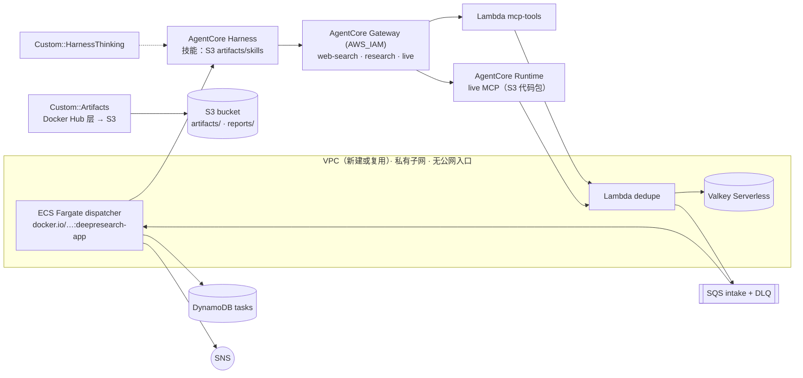

# CloudFormation 一键部署（不绑定区域 / 账号）

模板：[`deploy/cloudformation/deepresearch.yaml`](../deploy/cloudformation/deepresearch.yaml)。一个栈包含整套服务，部署时不需要本地构建，也不需要 ECR：代码制品和调度器镜像都从 Docker Hub（默认 `aws300/deploy`）拉取。

| 镜像 | 内容 | 用途 |
|---|---|---|
| `aws300/deploy:deepresearch-artifacts-<ver>` | `FROM scratch` 单层：`lambda.zip`、`live_runtime.zip`、`tools_schema.json`、`skills/`、`manifest.json` | 由自定义资源 `Artifacts` 解压到 `s3://<bucket>/artifacts/<ver>/` |
| `aws300/deploy:deepresearch-app-<ver>` | dispatcher / worker（linux/arm64） | ECS Fargate 服务（也可用于 EKS：`deploy/k8s/dispatcher.yaml`） |

## 1. 区域

Web Search 连接器目前只在 **us-east-1、eu-west-1、ap-northeast-1** 提供，模板的 `WebSearchRegion` 规则会拒绝其他区域（可用参数 `EnforceWebSearchRegion=false` 关闭）。默认模型 `global.anthropic.claude-sonnet-4-6`、`global.anthropic.claude-haiku-4-5-*`、`global.cohere.embed-v4:0` 都是全局推理配置，已在以上三个区域实测可用。

## 2. 部署

模板超过 51,200 字节，需要经 S3 中转：控制台“上传模板文件”会自动处理，CLI 需要指定 `--s3-bucket`（同区域的任意桶）。

```bash
REGION=us-east-1
STAGING=<同区域的任意 S3 桶>
aws cloudformation deploy --region $REGION --stack-name deepresearch-prod \
  --template-file deploy/cloudformation/deepresearch.yaml --s3-bucket $STAGING --s3-prefix templates \
  --capabilities CAPABILITY_NAMED_IAM CAPABILITY_AUTO_EXPAND \
  --parameter-overrides ProjectName=deepresearch EnvironmentId=prod
# 复用已有 VPC（私有子网须有 NAT 出口，且至少跨 2 个 AZ）：
#   VpcId=vpc-xxxx PrivateSubnetIds=subnet-a,subnet-b
```

`CAPABILITY_AUTO_EXPAND` 是 `AWS::LanguageExtensions` 需要的（用于按条件设置 `DeletionPolicy`）。实测全新创建（含新建 VPC、Valkey）约 20 分钟。

### 主要参数

| 参数 | 默认 | 说明 |
|---|---|---|
| `ProjectName` / `EnvironmentId` | `deepresearch` / `prod` | 所有资源名的前缀 `<project>-<env>`（harness / runtime 名用 `_` 连接） |
| `ArtifactRepository` / `ArtifactVersion` | `aws300/deploy` / `1.0.1` | 修改版本号即可滚动升级全部代码 |
| `RegistryCredentialsSecretArn` | 空 | `{"username","password"}`，用于避开 Docker Hub 匿名拉取的限流 |
| `VpcId` / `PrivateSubnetIds` | 空 | 为空时新建 VPC：2 个私有子网、1 个 NAT、S3/DynamoDB 网关端点 |
| `ResearchModelId` / `ThinkingBudgetTokens` | Sonnet 4.6 / `3000` | 研究模型与 extended thinking（`0` 关闭） |
| `HarnessNetworkMode` | `PUBLIC` | `VPC` 表示 harness microVM 运行在私有子网 |
| `MaxInflight` / `SessionCreatePerSec` / `DispatcherWorkers` / `DispatcherDesiredCount` | 100 / 20 / 16 / 1 | 准入控制与调度器规模（见 [QUOTAS.md](QUOTAS.md)） |
| `GatewayRateLimitPerCallerRpm` | 600 | 每个 IAM 主体每分钟的请求上限（`0` 关闭） |
| `EnableSemanticCache` | `true` | Valkey Serverless + VPC Lambda 语义合并 |
| `CreateMcpClientUser` | `true` | 创建仅有 `InvokeGateway` 权限的 IAM 用户，访问密钥存入 Secrets Manager |
| `RetainDataOnDelete` | `false` | 删除栈时是否保留报告桶和任务表 |

## 3. 栈内资源



| 分节 | 资源 |
|---|---|
| 网络 | VPC、子网、NAT、路由、S3/DynamoDB 端点（仅新建时）；`ServiceSG`（只出不进，组内开放 6379/6380） |
| 状态 | S3（SSE、全部阻止公开访问、仅 TLS）、SQS intake + DLQ（`maxReceiveCount` 50）、DynamoDB（PITR、TTL `ttl`）、SNS、Webhook HMAC 密钥 |
| 缓存 | ElastiCache Serverless Valkey 8（不设 AUTH：TLS + 安全组）+ 连接信息 Secret |
| 制品 | `ArtifactCopierFunction`：匿名或凭证拉取 registry 层，写入 S3；删除旧版本前缀；删除栈时清空桶 |
| AgentCore | Gateway（MCP 2025-11-25 + 2026-07-28、响应流、语义搜索、AWS_IAM）、3 个 Target、限流、Runtime（`PYTHON_3_12` 代码部署，入口 `live_main.py`）、Harness（托管 memory、summarization 截断） |
| 调度 | ECS 集群、Fargate ARM64 任务（1 vCPU / 2 GB）、服务（`AssignPublicIp: DISABLED`、部署熔断回滚） |
| 客户端 | `McpClient` 托管策略（只允许对本 Gateway 执行 InvokeGateway）、可选 IAM 用户 + 访问密钥 Secret |

各组件的配置全部来自环境变量 `DR_*`（`DR_REGION`、`DR_PROJECT`、`DR_STATE_*` 等），代码包里只带通用的 `config/settings.yaml`。

## 4. 本地工具接入栈

```bash
python scripts/use_stack.py deepresearch-prod --region us-east-1   # 写入 config/stacks/<stack>.{yaml,state.json,env}
source config/stacks/deepresearch-prod.env                          # DR_LOCAL_FILE / DR_DEPLOY_STATE / AWS_REGION ...
python scripts/mcp_connect.py --setup-profile                        # 从 Secret 写入最小权限 profile <project>-mcp
bash scripts/setup_claude_mcp.sh                                     # Claude Code 接入（user 作用域）
python scripts/live_research.py "研究问题" --depth quick --save ./reports/x.md
DR_E2E_OUT=e2e_out/matrix-deepresearch-prod python scripts/e2e_matrix.py   # 全 API 矩阵
```

`use_stack.py` 不会改动现有的 `config/local.yaml` 和 `config/deploy_state.json`，多个部署可以并存，用 `source` 切换即可。

## 5. 升级、回滚与删除

- **升级**：推送新版本的两个镜像（`python deploy/build_artifacts.py --push`），然后用新的 `ArtifactVersion` 更新栈。Lambda、Runtime 代码、harness 技能包和调度器镜像会一起滚动；旧的 `artifacts/<old>/` 在更新成功后自动删除。
- **回滚**：更新失败时 CloudFormation 自动回滚到上一版本（已实测：新版本前缀被清理，服务保持在旧版本）。
- **删除**：`RetainDataOnDelete=false` 时，自定义资源先清空桶，再删除桶和表；为 `true` 时两者保留。
- **VPC 模式 harness 的删除**：`HarnessNetworkMode=VPC` 时，AgentCore 会在 `ServiceSG` 里创建服务托管的网卡（类型 `agentic_ai`，标签 `AmazonBedrockAgentCoreManaged=true`）。harness 删除后，这些网卡仍由服务侧挂载一段时间（实测超过 40 分钟），无法手动删除，所以 `ServiceSG` 可能删除失败、栈进入 `DELETE_FAILED`。处理办法：等网卡回收后再次执行 `delete-stack`；或者先 `aws cloudformation delete-stack --retain-resources ServiceSG` 完成删除，稍后再删这个安全组。如果 VPC 也是这个栈新建的，VPC 要等安全组删掉之后才能删除。PUBLIC 模式（默认）没有这个问题。

## 6. 实测记录（2026-09-28，us-east-1，新建 VPC）

| 步骤 | 结果 |
|---|---|
| 全新创建（1.0.0） | `CREATE_COMPLETE`，约 20 分钟；调度器从 Docker Hub 拉镜像运行，无公网 IP |
| 升级 1.0.0 → 1.0.1 | `UPDATE_COMPLETE`；技能包 URI 切换到 1.0.1，旧前缀已删除，调度器滚动到 `app-1.0.1` |
| 升级失败回滚 | 自动回到 1.0.0，服务不中断 |
| 端到端 | 12 通过 / 0 失败 / 1 跳过，见 [README 4.3](../README.md#43-cloudformation-部署上的全-api-矩阵2026-09-28us-east-1新建-vpcfargate-调度器) |
| 复用已有 VPC + 关闭缓存 + VPC 模式 harness | 栈 `deepresearch-e2e3` 创建成功；修复 ECR 权限后跑通同步研究，随后删除整栈（见下） |

部署过程中发现并已在模板中修复的问题：

| 问题 | 修复 |
|---|---|
| 内联 Lambda 运行时里没有 `cfnresponse` 模块，自定义资源一直收不到回应 | 模板内实现最小版 `send()`；所有自定义资源设置 `ServiceTimeout`（最长 15 分钟，而非默认 1 小时） |
| CloudFormation 把 Harness `AdditionalParams` 里的数字转成字符串（`"budget_tokens": "3000"`），模型接口拒绝 | Harness 不设置 `AdditionalParams`，改由 `Custom::HarnessThinking` 用 SDK 写入整数；它会在每次 Harness 被更新后重新应用 |
| `UpdateHarness` 以调用者身份级联更新底层 Runtime、workload identity，需要额外权限 | helper 角色被授予本账号本区域内的 `bedrock-agentcore:*`（只在部署时运行） |
| 回滚删除 LogGroup 后，Lambda 又自动建了同名日志组，导致下次创建冲突 | 所有 Lambda 角色不再授予 `logs:CreateLogGroup`，只允许写栈内自己的日志组 |
| Gateway 在创建 Target 时就用刚授予的权限做校验 | `Custom::Wait`（30 秒）等待 IAM 传播 |
| VPC 模式的 harness 每个新会话都报 `Runtime initialization time exceeded`，Runtime 日志显示拉取 harness 镜像时 `no basic auth credentials` | VPC 模式下由 microVM 用执行角色拉取镜像：`HarnessRole` 补上 `ecr:GetAuthorizationToken` / `BatchGetImage` / `GetDownloadUrlForLayer`（PUBLIC 模式由服务拉取，不需要这条权限）。首个会话约 38 s 完成初始化 |
| harness 事件流偶发中途断开（`Response ended prematurely`），任务直接失败 | worker 带退避重新连接同一个会话并续跑（最多 4 次；上一轮仍在执行时等待后重试）；限流错误仍交给调度器退避。已加单元测试 |
